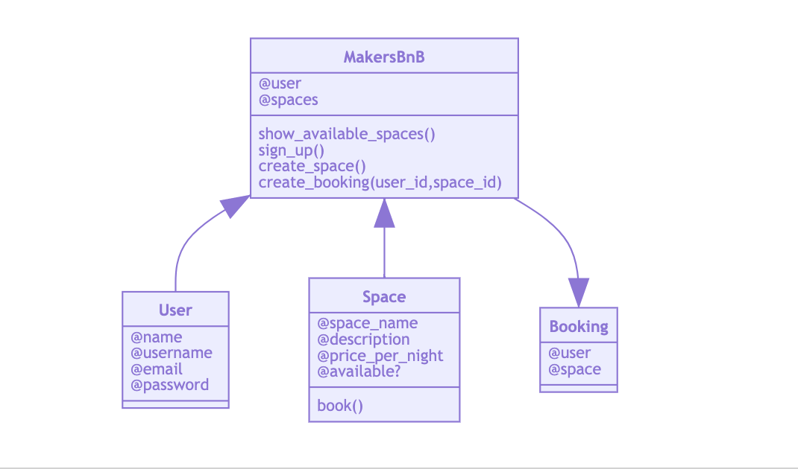
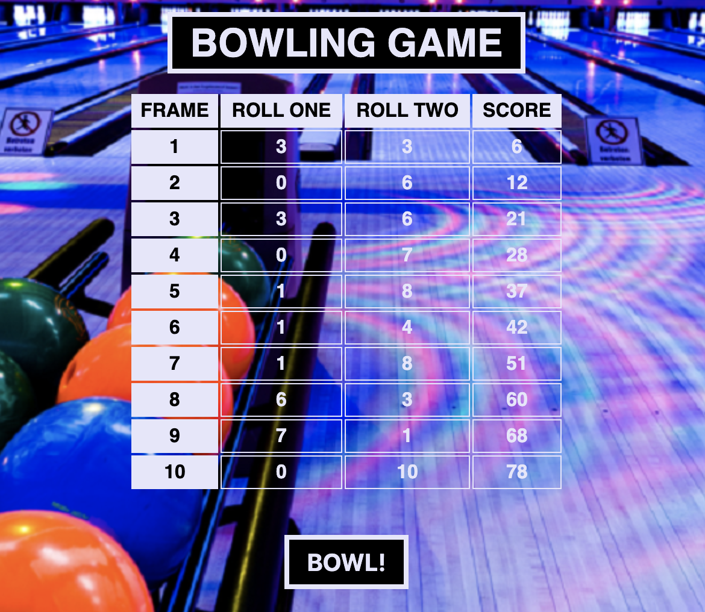

# Week  Goals

By the end of the week all developers can build tested, easy-to-change software in a team using these processes:

- Break down projects into tasks and allocate them to pairs
- Build to a specificiation (rather than challenges)
- Run stand-ups and retrospectives
- Use a branch/PR/merge git workflow
- Give and receive meaningful code review

<br>

***

<br>

# Project Week: Makers BnB
Work in teams to build a clone of AirBnB and learn about organizing your own work.
You can see the repository with the whole project [here](https://github.com/jarasmar/MakersBnB)

## The Team
- Ben Galley
- Rafa Hernandez
- Patrick Oliver
- Neha Singh
- Jara Santamaria

## The roles
We decided to take a different role everyday to divide the tasks equally so on Monday we set up who would be doing each thing each day.
- Scrum Master
  - Runs team’s Agile processes and meetings (runs stand-up and retro)
  - Helps arrange backlog of tasks
  - Facilitates resolution of disagreements and conflicts
  - Helps clarify tasks and assists in estimation of those tasks
- Leader
  - Makes sure that everyone is working on the right tasks
  - Makes sure everyone is working well together
  - Sets up the lunch zoom space for the team check in
- Scribe + Reporter
  - Update Trello Board (assign persons to task in the board, move tasks to de doing/done cards, add todo cards...)
  - Update Readme
  - Make notes about group activities and meetings
  - Reports what the group is working on and has done, both within the team and externally
- Challenger + Ideas Person
  - Tries to think of what might go wrong
  - Tries to think of alternative ideas to solve problems
  - Explains these ideas to the team
- Helper & Technician
  - Looks out for members who have taken on too much as well as members who don’t have enough to do
  - Looks out for the health of other members, ensures they’re taking breaks
  - Finds ways to keep team motivation up and makes sure successes are celebrated
  - Looks after the team’s tools and materials
  - Check that GitHub repo is up to date at the end of the day and all members have the last version of the project
  - Merging all branches after evening retro
  - Makes sure everyone has the tools they need to do their job

## The tools
- Trello Board (see it [here](https://trello.com/b/4E76SK8e/makersbnb))
- Zoom for remote pair/group work
- GitHub
- Slack for group messages
- Mermaid (Domain Models)

## Work Structure
The first day we spend a lot of time planing on how to organize our working flow during the rest of the week and the expectations we had about the project. We decided to work every day in two pairs and one solo, and divided this equally for the rest of the week, so we would get to work with everyone and alone too.

### Release Planning Meeting
- Turn specifications into user stories
- Decide a priority order for the user stories (MVP iterations)
- Schedule the releases
- Make a full view plan for the project
- Design Database tables
- Create a Domain Model

### Daily Schedule Structure
- Morning meeting
  - Decide which pending tasks were the most important for the day
  - Assign tasks to every pair
- Lunck check
  - Briefing on how work is going
  - Merge if needed
  - Make readjustments in the working flow if needed
- Evening meeting
  - Explain to the rest of the team the work done over the day
  - Update Trello and add pending tasks
  - Merge and pull so all of us have the same files in the project
  - Reflections
  - Suggestions
  - Feedback
  - Mood checkings

## The Project

From the beggining we decided our main priority would be back-end so our front-end is almost not implemented. The date selection is fully planed too but we didnt have time to implement it either.

### Specifications and User Stories
Any signed-up user can list a new space.
  - As a user, I need to sign-up.  (name, username, email, password)✅
  - As a user, I need to log-in. (username, password) ✅
  - As a user, I need to log-out.✅
  - As a Owner, I want to be able to list a new space ✅

Users can list multiple spaces ✅

As A Owner, I want to be able to list multiple spaces.✅
  - Users should be able to name their space, provide a short description of the space, and a price per     night.
  - As a Owner, I want to be able to name my spaces.✅
  - As a Owner, I want to be able to be able to add a description to my spaces✅
  - As a Owner, I want to be able to add a price per night to my spaces✅

Any signed-up user can request to hire any space for one night, and this should be approved by the user that owns that space.
  - As a Client, I would like to request a space for a night.✅
  - As a Owner, I would like to be able to approve requests to stay at my space✅
  - As a Owner, I would like to be able to decline requests to stay at my space✅
  - Nights for which a space has already been booked should not be available for users to book that space ✅
  - As a Client, I don't want to see rooms that have an accepted booking request for my chosen dates (not available).✅
  - Until a user has confirmed a booking request, that space can still be booked for that night. ✅
  - As a client, I can make a booking request for a room with an existing booking request that has not yet been approved. (maybe available)✅

### Domain Model


### Databases

We created our databases with the following tables:
- Users: user_id - name - email - password
- Spaces: space_id - space_name - description - price - user_id - available
- Bookings: booking_id - user_id - space_id


### View Plan
```
get '/'                     -->  display index.erb (link to sign_up and sign_in - spaces list)

get '/sign_up'              -->  display sign_up.erb (sign_up form, submit button)
post '/sign_up'             -->  redirect to ./sign_in (saves data to users table in DB)

get '/sign_in'              -->  display sign_in.erb (sign in form)
post '/sign_in'             -->  redirect to ./user (authenticates and gets new user from DB)

post '/sign_out'            -->  removes current user data

get '/user'                 -->  display user.erb (link to my_bookings - link to my_spaces - space list with links to book_space - menu)

get '/my_bookings/:user_id' -->  display my_bookings.erb (list of bookings with status - link to '/user')

get '/my_spaces'            -->  display my_spaces.erb (list of my spaces - link to create_space - link to manage_spaces - link to user)

get '/my_spaces/create_space'  -->  display spaces/create.erb (create_space form, save_button, link to my_spaces)
post '/my_spaces/create_space  -->  redirect to ./my_spaces (saves space to spaces table in DB)

get '/my_spaces/manage'     -->  display space_management.erb (list of my spaces with booking requests and accept/decline options)
post '/my_spaces/manage'    -->  redirect to ./my_spaces/manage (modifies availability in spaces DB)

get '/book_space/:id'     -->  display book_space.erb (space, confirm_booking_button)
post '/book_space/:id'    -->  redirect to ./my_bookings/user (creates a new booking instance, save data into bookings DB)
```


## Weekend Challenge: Bowling

See the full project [here](https://github.com/jarasmar/bowling-challenge)

### The Task

Count and sum the scores of a bowling game for one player (in JavaScript).

A bowling game consists of 10 frames in which the player tries to knock down the 10 pins. In every frame the player can roll one or two times. The actual number depends on strikes and spares. The score of a frame is the number of knocked down pins plus bonuses for strikes and spares. After every frame the 10 pins are reset.

### Domain Model
- Constructor Function Game
  - Initializes with `this.rolls = []`
- Prototype Function `roll(pins)`
  - Pushes pins into `this.rolls`
- Prototype Function returnScore
  - Initializes with a variable `score = 0` and `rollIndex = 0`
  - Iterates 10 times over `this.rolls` and adds to the score depending on the pins and bonuses, checking for spares and strikes.


### How does Bowling work?

**Strikes**

The player has a strike if he knocks down all 10 pins with the first roll in a frame. The frame ends immediately (since there are no pins left for a second roll). The bonus for that frame is the number of pins knocked down by the next two rolls. That would be the next frame, unless the player rolls another strike.

**Spares**

The player has a spare if the knocks down all 10 pins with the two rolls of a frame. The bonus for that frame is the number of pins knocked down by the next roll (first roll of next frame).

**10th frame**

If the player rolls a strike or spare in the 10th frame they can roll the additional balls for the bonus. But they can never roll more than 3 balls in the 10th frame. The additional rolls only count for the bonus not for the regular frame count.

    10, 10, 10 in the 10th frame gives 30 points (10 points for the regular first strike and 20 points for the bonus).
    1, 9, 10 in the 10th frame gives 20 points (10 points for the regular spare and 10 points for the bonus).

**Gutter Game**

A Gutter Game is when the player never hits a pin (20 zero scores).

**Perfect Game**

A Perfect Game is when the player rolls 12 strikes (10 regular strikes and 2 strikes for the bonus in the 10th frame). The Perfect Game scores 300 points.

In the image below you can find some score examples.

**Examples for the Tests:**

- Gutter Game
```
-/- -/- -/- -/- -/- -/- -/- -/- -/- -/- = 0
```
- Spare Frame
```
5/5 3/- -/- -/- -/- -/- -/- -/- -/- -/- = 16
```
- Strike Frame
```
10 1/1 -/- -/- -/- -/- -/- -/- -/- -/- = 14
```
- Perfect Game
```
10 10 10 10 10 10 10 10 10 10 10 10 = 300
```

### Interface

After I had all my tests passing and all the specifications covered I decided to do some front-end to practice everything I learned from Thermostat Project.
I created an HTML table with ten frames that take roll_1, roll_2 and current score for each of them.
It has a click button 'bowl' that plays a random frame at a time and keeps updating the score through each of them. After 10 frames, on the next click it pops out a message 'Game Over'.
The interface is not fully conected to backend and there is no bonus added in the score.




***

<br>


# Weekend Reflections

### Did you meet all of your goals you set at the start of the week?
* Answers here

### What things do you still need to work through?
* Mocking
* And this

### What would you change/improve moving forward?
##### Technical: 
* This
* And this
##### Personal:
* This
* And this

### A pat on the back
* I 
<br>
